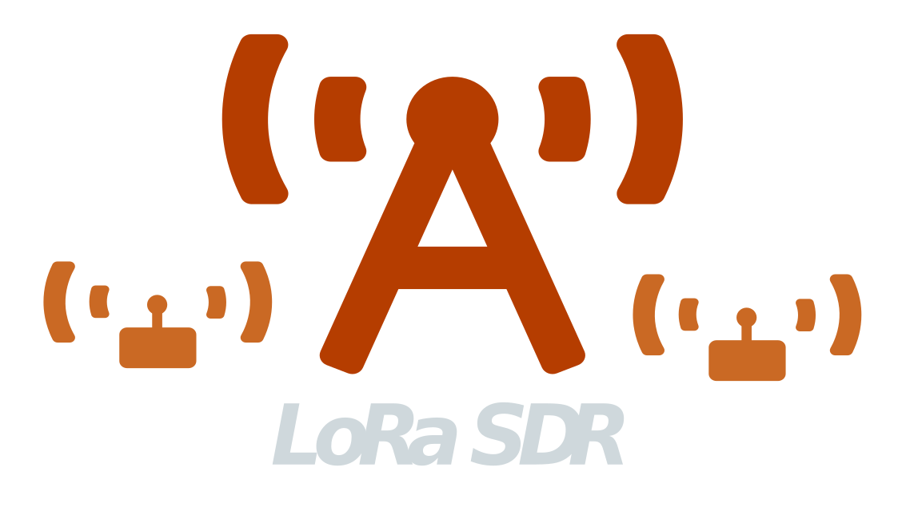

[](https://martynvdijke.github.io/gr-lora_sdr/html/index.html)

[](https://arxiv.org/abs/2002.08208)
[](https://github.com/martynvdijke/gr-lora_sdr/blob/dev/LICENSE)

<!-- PROJECT LOGO -->
<br />
<p align="center">
  <a href="https://github.com/martynvdijke/gr-lora_sdr/settings">
    
  </a>

  <h3 align="center">Gnuradio - LoRa SDR</h3>

  <p align="center">
    Fully-functional GNU Radio blocks to implement the physical layer (PHY)of LoRa
    <br />
    <a href="https://martynvdijke.github.io/gr-lora_sdr/html/index.html"><strong>Explore the docs »</strong></a>
    <br />
    <br />
    <a href="https://github.com/martynvdijke/gr-lora_sdr/wiki">Running the demo</a>
    ·
    <a href="https://martynvdijke.github.io/gr-lora_sdr/issues">Report a bug</a>
    ·
    <a href="https://martynvdijke.github.io/gr-lora_sdr/issues">Request a feature</a>
  </p>
</p>

## Summary

This is the fully-functional GNU Radio software-defined radio (SDR) implementation of a LoRa transceiver with all the necessary receiver components to operate correctly even at very low SNRs. This work has been originally conducted at the Telecommunication Circuits Laboratory, EPFL and later the code has been extended at the Technical University of Eindhoven.
The extension of this project is to implement a simulated multi-stream gateway, this is currently implemented in an experimental version.
More information on this extended work is available in the [paper](main.pdf) in this repo.


In the GNU Radio implementation of the LoRa Tx and Rx chains the user can choose all the parameters of the transmission, such as the spreading factor, the coding rate, the bandwidth, the presence of a header and a CRC, the message to be transmitted, etc.

- In the Tx chain, the implementation contains all the main blocks of the LoRa transceiver: the header- and the CRC-insertion blocks, the whitening block, the Hamming encoder block, the interleaver block, the Gray mapping block, and the modulation block.
- On the receiver side there is the packet synchronization block, which performs all the necessary tasks needed for the synchronization, such as the necessary STO and CFO estimation and correction. The demodulation block follows, along with the Gray demapping block, the deinterleaving block, the Hamming decoder block and the dewhitening block, as well as a CRC block.
- The implementation can be used for fully end-to-end experimental performance results of a LoRa SDR receiver at low SNRs.

## Acknowledgements

This work was based on [github.com/rpp0/gr-lora](https://github.com/rpp0/gr-lora) by Pieter Robyns, Peter Quax, Wim Lamotte and William Thenaers. Which architecture and functionalities have been improved to better emulate the physical layer of LoRa.
This work also used the kiss FFT libary from [github.com/mborgerding/kissfft](https://github.com/mborgerding/kissfft) for FFT operations. 
Finally this code is a fork from [github.com/tapparelj/gr-lora_sdr](https://github.com/tapparelj/gr-lora_sdr) who made the original code.

Next to code this project is based on :

> J. Tapparel, O. Afisiadis, P. Mayoraz, A. Balatsoukas-Stimming, and A. Burg, “An Open-Source LoRa Physical Layer Prototype on GNU Radio” [1]

Which can be found at [arxiv.org/abs/2002.08208](https://arxiv.org/abs/2002.08208), if you find this implementation useful for your project, please consider citing the aforementioned paper.

## Getting started

### Documentation

- The documentation of the cpp source files can be found at [docs](https://martynvdijke.github.io/gr-lora_sdr/html/index.html) and is automatically build from source using doxygen.
- The more practical and high level documentation along with examples can be found on the [wiki](https://github.com/martynvdijke/gr-lora_sdr/wiki)

Both are WIP

### Installation
There is an Arch Linux package called **_gr-lora_sdr-git_** simply it using your favourite aur helper.
Similarly to any GNU Radio OOT module, it can be build using Cmake and make.

1. Clone the repo
   ```sh
   git clone https://github.com/martynvdijke/gr-lora_sdr
   ```
2. Enter the cloned directory
   ```sh
   cd gr-lora_sdr
   ```
3. Make build folder and enter it
   ```sh
   mkdir build && cd build
   ```
4. Configure cmake
   ```sh
   cmake ../ #-DCMAKE_INSTALL_PREFIX=/usr for Arch Linux users
   ```
5. Make install
   ```sh
   sudo make install
   ```
   You will need root or sudo access in order to properly install the repo, since it will add module blocks to be used in gnuradio-companian and makes a local python package. Be sure to have the following requirements installed:

### Requirements
    - Gnuradio 3.8
    - python >2.7
    - cmake >3.8
    - swig  >4.0
    - libvolk
    - UHD 
    - doxygen (optional for documentation)
    - log4cpp (optional for logging/debugging)
## Changelog
For changelog checkout [Changelog](CHANGELOG.md)
## TODO
For TODO list checkout [TODO](TODO.md)
## License

Distributed under the GPL-3.0 License License. See [LICENSE](LICENSE) for more information.
